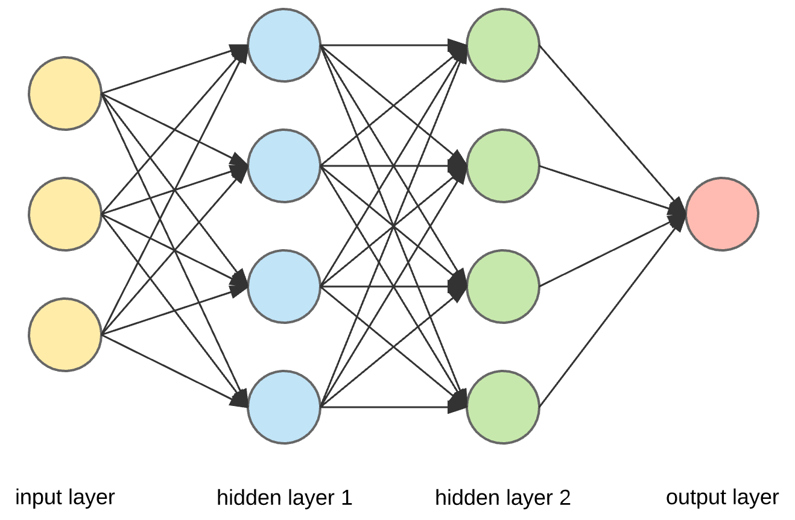

```{r setup, include=FALSE}
knitr::opts_chunk$set(echo = FALSE)
source("need.packages.R")
pkg <- c("kableExtra", "dplyr", "ggplot2", "DT", "httpuv",
         "mlbench", "ipred", "randomForestSRC", "MASS",
          "survival", "kableExtra", "knitr", "xml2",
           "keras", "tensorflow",
            "neuralnet")
need.packages(pkg)
```


## Getting Started
- The source codes and necessary documentations are available at the repository: ( https://github.com/mdtuhinsheikh/MLSurv).
- The lecture slides are available at the [https://mdtuhinsheikh.github.io/MLSurv/](https://mdtuhinsheikh.github.io/MLSurv/).


## About Me
- Third year Ph.D. Student in Statistics, UConn.
- Research Interests:
  + Bayesian biostatistics
  + Modelling informative dropout process
  + Machine learning and deep learning
  + Microbiome data analysis
- Future goals: 
  + Contribute to the broader field of biostatistics and statistical learning.

## Assumption about the audience
- Have good understanding of time-to-event data.
- Familiar with the well-known survival analysis methods.
  
## Aims of the lecture
- By the end of this lecture, the participants should have a basic understanding of
  + the use of machine learning and deep learning techniques
  + possible impacts of these techniques into the field of survival analysis

## Contents 
- Basics of machine learning and deep learning
- Illustration of machine learning and deep learning usinng R
- Applications of machine learning in survival analysis
- Recent developments
- Future directions

## Machine Learning (ML)
- Humans learn from past experiences, <u>whereas</u>, machines follow instructions given by humans.
- What if human can train the machines? 


## Traditional vs ML algorithm
<center>
{width=650px, height=300px}
</center>

## Basic paradigm of ML algorithm
<center>
{width=750px, height=200px}
</center>

## An example of ML: 'Get the cake' 
<center>
{width=750px, height=300px}
</center>

## An example of ML: 'Get the cake'  cont...
<center>
{width=750px, height=200px}
</center>

## An example of ML: 'Get the cake'  cont...
<center>
{width=750px, height=300px}
</center>

## Popularly used ML techniques
- Classification trees: 
  + bagging [@breiman1998arcing; @breiman1996bagging], 
  + random forest (RF) [@breiman2001random].
- Support vector machine
- Neural network: shallow or deep neural network (DNN)
- Others

## An example of Bagging and RF using R
- R Packages required: randomForestSRC, ipred, MASS, Survival
```{r echo=TRUE}
data(breast, package = "randomForestSRC")
breast <- na.omit(breast)
names(breast)[1:10] # Displaying only ten variable names
```
- The **breast** dataset is from **randomForestSRC** R package.
- For more details about the data: visit this [link](http://archive.ics.uci.edu/ml/datasets/Breast+Cancer+Wisconsin+(Prognostic))

## An example of Bagging and RF using R cont...
- The goal is to classify the status using decission tree
```{r echo=TRUE}
mod1 <- rfsrc(status ~ ., data = breast, nsplit = 10)
mod2 <- bagging(status ~ ., data = breast, coob=TRUE)
res <- as.data.frame(c(mean(mod1$err.rate[, 1], na.rm = TRUE), 
            mod2$err))
colnames(res) <- "Error Rate"
rownames(res) <- c("RSF", "Bagging")
```
- The misclassification error for the two approaches
```{r}
res
```

## Notes on Bagging and RF
- Both are based on resampling techniques.
- Both are widely used for classification.

## Basics of Deep Learning
- **Deep Learning** is very similar to human neural system
  + It is a special kind of **Machine Learning** [@goodfellow2016deep].
- Especially, useful to generalize complicated functions in high dimensional space.
- Synonymous terms: 
  + deep neural network (DNN)
  + deep feed-forward networks
  + feed-forward neural networks 
  + multi-layer perceptrons (MLPs). 


## Understanding neural system
<center>
{width=850px, height=300px}
</center>

## DNN example 1
<center>
{width=850px, height=300px}
</center>

## DNN example 1 cont..
<center>
{width=850px, height=300px}
<center>

## DNN example 1 DNN cont..
<center>
{width=850px, height=300px}
</center>

## DNN example 2
<center>
{width=850px, height=300px}
</center>

## Visualization of one-layer DNN 
<center>
{width=550px, height=300px}
</center>

## Visualization of two-layer DNN 
<center>
{width=550px, height=300px}
</center>

## Visualization of multi-layer DNN 
<center>
{width=850px, height=300px}
</center>

## An example of DNN
- R Packages required: neuralnet, MASS.
- Dataset: **Boston** from **MASS** package in R.
```{r echo=TRUE}
set.seed(500)
data(Boston, package = "MASS")
names(Boston)
index <- sample(1:nrow(Boston), round(0.75*nrow(Boston)))
train <- Boston[index, ]
test <- Boston[-index, ]
lm.fit <- glm(medv~., data=train)
pr.lm <- predict(lm.fit, test)
MSE.lm <- sum((pr.lm - test$medv)^2)/nrow(test)
```
## An example of DNN cont...
- For more detail of the data: '?Boston'
- Performing newral network model on the Boston data
```{r echo = TRUE}
maxs <- apply(Boston, 2, max) 
mins <- apply(Boston, 2, min)
scaled <- as.data.frame(scale(Boston, center = mins, scale = maxs - mins))
train_ <- scaled[index, ]
test_ <- scaled[-index, ]
n <- names(train_)
f <- as.formula(paste("medv ~", paste(n[!n %in% "medv"], collapse = " + ")))
nn <- neuralnet(f, data=train_, hidden=c(5,3), linear.output=T)
```

## An example of DNN cont...
```{r, fig.align='center'}
plot(nn, rep = "best")
```

## An example of DNN cont...
```{r echo=TRUE}
pr.nn <- compute(nn,test_[,1:13])
pr.nn_ <- pr.nn$net.result*(max(Boston$medv)
          -min(Boston$medv))+min(Boston$medv)
test.r <- (test_$medv)*(max(Boston$medv)
              -min(Boston$medv))+min(Boston$medv)
MSE.nn <- sum((test.r - pr.nn_)^2)/nrow(test_)
print(paste(MSE.lm, MSE.nn))
```

## An example of DNN cont...
```{r fig.align='center'}
plot(test$medv, pr.nn_, col='red', main='Real vs predicted NN', 
       pch=18,cex=0.7, xlab="Observed", ylab = "Predicted")
points(test$medv, pr.lm, col='blue', pch=18, cex=0.7)
abline(0,1,lwd=2)
legend('bottomright', legend=c('NN','LM'), pch=18, col=c('red', 'blue'))
```


## Applications of ML
- $\color{blue}{\text{Data mining:}}$ web click data, medical records, Google search.
- $\color{blue}{\text{Signal recognition:}}$ autonomous helicopter, handwriting recognition, voice recognition, Machine translation, Anomaly detection.
- $\color{blue}{\text{Self customizing program:}}$ Amazon, Netflix, Bixby (Samsung), Siri (iphone).
- $\color{blue}{\text{On survival analysis:}}$
  + Predicting patients' survival
  + Classifying competing risks for an event
  + Personalized treatment recommender system

# Survival data analysis

## Survival data
- Notations: 
$$
\begin{align*}
i     &: \text{index for subject } (i=1, \ldots, n)\\
T_i^* &: \text{time for event for subject }  i \\
C_i   &: \text{censoring time for subject } i \\
T_i   &= \min (T_i^*, C_i), \text{observed  time for subject } i \\ 
\delta_i &= I(T_i^* \le C_i), \text{censoring indicator for subject } i\\
\mathbf{x}_i &: \text{vector of covariates for subject } i
\end{align*}
$$
- Observed survival outcome: $\{ (T_i, \delta_i), i=1, \ldots, n \}$.

## An illustration of time-to-event data
<center>
{width=550px, height=300px}
<!--    \caption{An illustration of survival data [Wang2019]} -->
</center>

## Some interesting questions
- Analyzing patient 1, 4, 8, 9 might give us insight on which features contribute to increase the length of survival?
- Patients who survived to 12 months, what is probability that the event will occur after $t$ time?
- A doctor might want to see what is the chance of re-hospitalizing after the patient is discharged?
- Can we predict the sub-types of the event (considering the sub-types are missing) based on learning the training data?

# Some real-life examples of survival data

## Applications in healthcare
<center>
{width=750px, height=400px}
</center>

## Applications in healthcare cont...
- **Event of interest:** Rehospitalization; Disease recurrence; Cancer survival.
- **Outcome:** Likelihood of hospitalization within $t$ days of discharge. 
- Figure source: @wang2019machine

## Applications in education
<center>
{width=750px, height=400px}
</center>

## Applications in education cont...
- **Event of interest:** Student dropout.
- **Outcome:** Likelihood of a student being dropout within $t$ days. 
- Figure source: @wang2019machine

## Applications in Crowdfunding
<center>
{width=750px, height=400px}
</center>

## Applications in Crowdfunding cont...
- **Event of interest:** Project success
- **Outcome:** Likelihood of a project being successful within $t$ days.
- Figure source: @wang2019machine

## Traditional approaches to analyse survival data
- **Non-parametric:** Kaplan-Meier, Nelson-Aalen, Life table
<!--  + Useful at population level but not useful at individual level. -->
- **Semi-parametric:** Cox proportional hazards (PH) model
<!--  + the proportionality assumption and linearity of the log-risk function might not be appropriate in complex data structure. -->
- **Parametric:** Accelerated failure time model
<!--  + violation of the distribution might compromise with the consistency of the parameter estimates.-->


## Cox PH model 
- The Cox PH model [@cox1972regression] is 
$$
\begin{equation}
h_i(t | \mathbf{x}_i) = h_0(t) \exp{(\mathbf{x}'_{i} \boldsymbol{\beta})} 
\end{equation}
$$
where, $\mathbf{x}_i = (x_{i1}, \ldots, x_{ip})$ denotes the vector of covariates and $\boldsymbol{\beta}$ are the corresponding regression coefficients.
- The Cox PH partial likelihood function is given by
$$
\begin{equation*}
pl(\boldsymbol{\beta}) =  \prod_{i=1}^{D} \Big[ \dfrac{\exp(\mathbf{x}_i^T \boldsymbol{\beta})}{\sum_{j \in \mathcal{R}(T_i)} \exp(\mathbf{x}_j^T \boldsymbol{\beta})} \Big]
\end{equation*}
$$
where, $t_1, t_2, \ldots, t_D$ denote the ordered event times and $\mathcal{R}(t_i)$ denotes the risk set at time $t_i$.

## Cox PH model cont...
- The corresponding the log partial likelihood function is 
$$
\begin{equation}
\ell(\boldsymbol{\beta}) =  \sum_{i=1}^{D} \Big( \mathbf{x}_i^T \boldsymbol{\beta} -  \log \sum_{j \in \mathcal{R}(t_i)} \exp(\mathbf{x}_j^T \boldsymbol{\beta}) \Big) 
\end{equation}
$$

## Estimation
- Maximizing the log partial likelihood function, we get the estimates of the model parameters.
- Evaluating the second derivative with respect to the model parameters, we calculate the information matrix.
- Standard error of the parameters are estimated by the inverse of the information matrix.

## Why ML algorithms?
- Increasing data size
- Increasing model size
- Increasing 
  + accuracy, 
  + complexity, and 
  + real-world impact
- The need for supervised learning

## ML for Survival Analysis
- Survival Tree: is similar to decision tree which is built by recursive splitting of tree nodes. 
  + Bagging Survival Trees \citep{hothorn2004bagging}
  + Random Survival Forest (RF) \citep{ishwaran2008random}
- Let us demonstrate one example in the following slides.

## An example of RSF and Cox PH using R 
- R Packages required: randomForestSRC, ipred, MASS, Survival
```{r echo=TRUE}
data(veteran, package = "randomForestSRC")
names(veteran) # Displaying variable names
```
- The **veteran** dataset is from **randomForestSRC** R package.
- For more details about the data: visit this [link](https://stat.ethz.ch/R-manual/R-devel/library/survival/html/veteran.html)

## An example of of RSF and Cox PH using R cont...
```{r echo=TRUE}
mod3 <- coxph(Surv(time, status)~., data=veteran,x=TRUE,y=TRUE)
mod4 <- rfsrc(Surv(time, status) ~ ., data = veteran, ntree = 100)
cindex <- as.data.frame(c(concordance(mod3)$concordance, 
            1-mean(mod4$err.rate, na.rm=T)))
colnames(cindex) <- "C-index"
rownames(cindex) <- c("Cox PH", "RSF")
```
- The C-index for the two models
```{r}
cindex
```

## Notes on Cox PH and RSF
- The RSF:
  + is advantageous for classification.
  + For example, a new patient with 'status' <u>unknown</u>,
  + However, RSF <u>cannot</u> predict time-to-event and perform regression analysis.
- The Cox PH model: 
  + is preferred to predict time-to-event and perform regression analysis.
  + the proportionality assumption and linearity of the log-risk function might not be appropriate in complex data structure.

## ML for Survival Analysis cont..
- DNN: use deep hidden layers to extract the output based on the features. 
  + Bayesian DNN [@polson2017deep; @ranganath2016deep]
- $\color{red}{\text{Note:}}$ 
  + could be useful for both classification and regression
  + robust to the violation of the proportionality assumption
  
## Previous works
- Feed-forward non-linear proportional hazards model [@faraggi1995neural].
  + Extended the linearity assumption of log-risk with the linear combination of the covariates to non-linear relationship. 
  + In particular, used logit function with some hyper-parameters.
- Bayesian version of Feed-forward non-linear proportional hazards model [@faraggi1997bayesian].    
  + This model considered normal prior for the parameters and derived the posterior distribution of the parameters.


## Cox Non-proportional Neural Network Model
- The $\exp(\mathbf{x}'_{i} \boldsymbol{\beta})$ function in Cox PH model is replaced by a more general function $\color{red}{g_{\boldsymbol{\theta}}(\mathbf{x})}$ to accommodate non-linear relationship
$$
\begin{equation}
h_i(t | \mathbf{x}_i) = h_0(t) \exp{(\color{red}{g_{\boldsymbol{\theta}}(\mathbf{x})})} 
\end{equation}
$$
- The likelihood function
$$
\begin{equation*}
pl(\boldsymbol{\theta}) =  \prod_{i=1}^{D} \Big[ \dfrac{\exp(\color{red}{g_{\boldsymbol{\theta}}(\mathbf{x}_i)})}{\sum_{j \in \mathcal{R}(T_i)} \exp(\color{red}{g_{\boldsymbol{\theta}}(\mathbf{x}_i)})} \Big]
\end{equation*}    
$$

## Cox Non-proportional Neural Network Model cont..
- The following loss function is optimized
$$
\begin{equation}
-\dfrac{1}{N_{\delta=1}} \sum_{i=1}^{D} \Big( g_{\boldsymbol{\theta}}(\mathbf{x}_i) -  \log \sum_{j \in \mathcal{R}(t_i)} \exp(g_{\boldsymbol{\theta}}(\mathbf{x}_i)) \Big) + \lambda ||\boldsymbol{\theta}||^2_2 \label{loss}
\end{equation}
$$
where, $N_{\delta=1}$ is the number of patients with an observable event and $\lambda$ is the $\ell_2$ regularization parameter.
- Gradient descent optimization is used to minimize the loss..


## Details on layer mechanism
<center>
{width=550px, height=300px}
</center>

## Details on layer mechanism cont...
<center>
{width=550px, height=300px}
</center>

## Computing Gradient: Backpropagation
<center>
{width=550px, height=150px}
</center>

## Computing Gradient: Backpropagation cont..
- How does a small change in one weight (e.g.\ $w^{(2)}_1$) affect the final loss $J(\mathbf{w})$)?
$$
\begin{equation*}
\dfrac{\partial J}{\partial w^{(2)}_1} = \dfrac{\partial J}{\partial \hat{y}} \dfrac{\partial \hat{y}}{\partial w^{(2)}_1}      
\end{equation*} 
$$
- How does a small change in one weight (e.g.\ $w^{(1)}_1$) affect the final loss $J(\mathbf{w})$)?
$$
\begin{equation*}
       \dfrac{\partial J}{\partial w^{(1)}_1} = \dfrac{\partial J}{\partial \hat{y}} \dfrac{\partial \hat{y}}{\partial z} \dfrac{\partial z}{\partial w^{(1)}_1}
\end{equation*} 
$$      

## Gradient descent optimization
- Initialize weights randomly $\sim N(0, \sigma^2)$
- Loop until convergence
  + Compute gradient, $\dfrac{\partial J(\mathbf{w})}{\partial \mathbf{w}}$
  + Update weights, $\mathbf{w}^{(t+1)} \leftarrow \mathbf{w}^{(t)} - \eta \dfrac{\partial J(\mathbf{w})}{\partial \mathbf{w}}$, where $\eta$ is called the learning rate. 
- Return weights.

## Complex Loss Function
<center>
{width=550px, height=300px}
</center>


## Neural network for survival
<center>
{width=550px, height=300px}
</center>

## Deep neural network for survival
<center>
{width=550px, height=300px}
</center>

## Performance of DeepSurv
- Evaluation Metric: Concordance (C) Index
- It is a rank order statistic for predictions against true outcomes.
- The index is calculated as the ratio of the concordant pairs to the total comparable pairs.
- Given the comparable instance pair $(i, j)$, with $t_i$ and $t_j$ are the actual observed times and $S(t_i)$ and $S(t_j)$ are the predicted survival times,
  + The pair $(i, j)$ is concordant if $t_i > t_j$ and $S(t_i) > S(t_j)$. 
  + The pair $(i, j)$ is discordant if $t_i > t_j$ and $S(t_i) < S(t_j)$.
- The concordance probability $=Pr(\hat{T}_i < \hat{T}_j | T_i < T_j)$ measures the concordance between the rankings of actual values and predicted values.

## Performance of DeepSurv cont..
```{r, echo=FALSE}
Experiment <- c("Simulated (Linear)", "Simulated (Nonlinear)", "WHAS", "SUPPORT",
                "METABOLIC", "Simulated Treatment", "Rotterdam GBSG")
CPH <- c(0.779, 0.487, 0.816, 0.583, 0.632, 0.517, 0.659)
DeepSurv <- c(0.778, 0.652, 0.867, 0.619, 0.654, 0.575, 0.676)
RSF <- c(0.758, 0.627, 0.893, 0.619, 0.620, 0.550, 0.648)
dt <- data.frame(Experiment, CPH, DeepSurv, RSF)
datatable(dt, rownames = FALSE, autoHideNavigation = T, 
          caption = 'Table 1: Results from Katzman et al. (2018)',
          class = 'cell-border stripe')
```

## More recent developments
- SurvELM:SurvELM: An R package for high dimensional survival analysis with extreme learning machine [@wang2018survelm]
  + comes with an interactive shiny app: [link](https://whcsu.shinyapps.io/SurvELM/).
- DeepHit: A deep learning approach to survival analysis with competing risks [@lee2018deephit].
  + can be applied in presence of competing risks data
- Cox-nnet: an artificial neural network method for prognosis prediction of high-throughput omics data  [@ching2018cox].
- RNN-SURV: A deep recurrent model for survival analysis [@giunchiglia2018rnn]
  
## Future direction
- Testing the effect of a covariate on the response. 
- Backpropagation method is computationally challenging.
- Non-convexity of optimizer results in convergence problem.
- How to choose the learning rate: $\color{blue}{\text{fixed}}$ or $\color{blue}{\text{adaptive}}$?
- Which method of optimization to be used: $\color{blue}{\text{gradient descent}}$, $\color{blue}{\text{stochastic gradient descent}}$, or others?
- How to handle overfitting: $\color{blue}{\text{dropout method}}$, $\color{blue}{\text{early stopping}}$?
- The design of hidden units.
- The design of the architecture: how many units it should have and how they should be connected. 
- The distribution of hyperparameters.
- Most of the newly developed techniques are not consistent!
  
## Acknowledgement
- Professor Ming-Hui Chen, Statistics, UConn.
- STAT 5645 (Fall 2019) class audience.

## Thanks
- Good luck with survival analysis.
- Feel free to contact for further queries: mdtuhin.sheikh@uconn.edu.

## References


